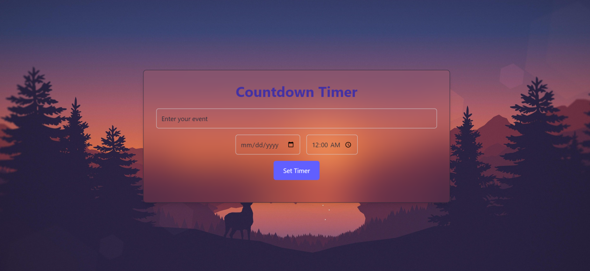

# Countdown Timer 🕒


An interactive **Countdown Timer** built with **React.js** and styled using **Tailwind CSS**. This app allows users to set an event name, target date, and time, and provides real-time countdown updates until the event arrives.

---


## Features ✨

- **Real-time Countdown**: Dynamically updates every second.
- **Event Customization**: Users can input an event name and select a target date and time.
- **Responsive Design**: Fully responsive and mobile-friendly UI powered by **Tailwind CSS**.
- **Animations**: Smooth animations and hover effects for an engaging user experience.
- **Reset Functionality**: Reset the timer and start over with a new event.

---
## Screenshots 📸

### Countdown Timer Interface
 

---

## Tech Stack 💻

- **Frontend**: React.js
- **Styling**: Tailwind CSS
- **State Management**: React Hooks (`useState`, `useEffect`)

---

## Getting Started 🛠️

### Prerequisites

- Node.js installed on your machine. Download it from [here](https://nodejs.org/).

### Installation

1. Clone the repository:
   ```bash
   git clone https://github.com/kasunsri/countdown-timer.git
